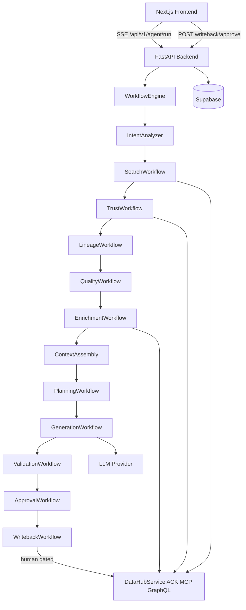

# Synex — Metadata-Aware Data Engineering Agent

> **DataHub Agent Hackathon Submission** · Built by **Daniel** & **Precious**
> **License:** [Apache 2.0](LICENSE) · **Frontend:** [synex-ai.vercel.app](https://synex-ai.vercel.app) · **Backend:** [synex-backend.onrender.com](https://synex-backend.onrender.com)

Synex is a **metadata-first AI agent** that reads your **DataHub GMS** catalog — schemas, tags, ownership, lineage — and generates **governed dbt SQL + `schema.yml`** contracts with deterministic PII masking, trust scoring, and AST validation. Every DataHub graph mutation is gated behind explicit human approval.

---

## Demo Video

[](https://www.youtube.com/)

> 3-minute walkthrough: prompt → metadata discovery → trust scoring → SQL generation → PII enforcement → approve writeback.

---

## What Synex Does

```
User Prompt
    │
    ▼
Intent Analysis          ← understands what dataset/model is needed
    │
    ▼
DataHub Search           ← queries GMS catalog (ACK MCP → GraphQL fallback)
    │
    ▼
Trust Scoring            ← ranks candidates by certification, lineage, quality
    │
    ▼
Lineage Analysis         ← maps upstream risks + downstream blast radius
    │
    ▼
Quality Assessment       ← checks assertions, incidents, profiling
    │
    ▼
Context Enrichment       ← pulls schema, docs, glossary, production SQL patterns
    │
    ▼
dbt SQL Generation       ← LLM synthesizes dialect-correct SQL grounded in metadata
    │
    ▼
Governance Validation    ← SQLGlot AST + DuckDB sandbox + PII hashing + YAML checks
    │
    ▼
Human Approval Gate      ← user reviews and approves before any DataHub mutation
    │
    ▼
DataHub Writeback        ← emits description, tags via ACK MCP tools
```

---

## Architecture



---

## Capabilities

| Capability | Status |
|---|---|
| DataHub Agent Context Kit MCP tools (`search`, `get_entities`, `get_lineage`, …) | ✅ Implemented (primary) |
| GraphQL fallback when ACK unavailable | ✅ Implemented |
| Deterministic trust scoring & candidate ranking | ✅ Implemented |
| Multi-provider LLM SQL + schema.yml generation | ✅ Implemented |
| SQLGlot AST + DuckDB sandbox + YAML + PII checks | ✅ Implemented |
| Session memory (`session_id` → prior SQL + structured context) | ✅ Implemented |
| Multi-aspect write-back proposals + human approval gate | ✅ Implemented |
| Run history & settings in Supabase | ✅ Implemented |
| Live lineage graph from run payload | ✅ Implemented when edges exist |
| Autonomous 15-stage workflow engine | ✅ Implemented |
| Live SSE workflow timeline UI | ✅ Implemented |
| Clarifying questions on ambiguous prompts | ✅ Implemented |
| Engineering Context Engine (SQL profile, docs, glossary) | ✅ Implemented |
| Validation retry + provider fallback + model selection | ✅ Implemented |
| Self-critique + confidence + observability metrics | ✅ Implemented |

---

## Tech Stack

| Layer | Technologies |
|---|---|
| Frontend | Next.js 14 (App Router), TypeScript, Zustand, ReactFlow, Monaco Editor |
| Backend | Python 3.11, FastAPI, Uvicorn, Pydantic v2 |
| Metadata | DataHub Agent Context Kit + GraphQL fallback + acryl-datahub emitter |
| LLM | OpenRouter, OpenAI, Anthropic, Groq, Mistral, DeepSeek |
| Validation | SQLGlot + DuckDB + PyYAML |
| Persistence | Supabase (PostgreSQL) |
| Deploy | Vercel (frontend) · Render (backend) |

---

## Quickstart (local)

### Prerequisites
- Node.js 18+ / npm
- Python 3.11 / pip
- Supabase project (free tier works)
- LLM API key — [OpenRouter](https://openrouter.ai) recommended (one key, many models)
- DataHub GMS — local Docker **or** cloud (optional — Synex degrades gracefully)

### 1. Clone
```bash
git clone https://github.com/danilao-bot/synex-ai.git
cd synex-ai
```

### 2. Supabase tables
Run in your [Supabase SQL Editor](https://supabase.com/dashboard):

```sql
CREATE TABLE public.synex_settings (
  id uuid NOT NULL DEFAULT gen_random_uuid() UNIQUE,
  datahub_url text NOT NULL DEFAULT 'http://localhost:8080',
  datahub_pat text,
  llm_provider text NOT NULL DEFAULT 'openrouter',
  llm_model text NOT NULL DEFAULT 'openai/gpt-4o',
  llm_api_key text,
  updated_at timestamptz DEFAULT timezone('utc', now()),
  created_at timestamptz DEFAULT now(),
  CONSTRAINT synex_settings_pkey PRIMARY KEY (id)
);

CREATE TABLE public.synex_runs (
  id uuid NOT NULL DEFAULT gen_random_uuid(),
  status text NOT NULL CHECK (status = ANY (ARRAY['RUNNING','SUCCESS','FAILED'])),
  prompt text NOT NULL,
  target_urn text,
  sql text,
  pii_columns jsonb DEFAULT '[]'::jsonb,
  created_at timestamptz DEFAULT timezone('utc', now()),
  session_id text,
  target_name text,
  dbt_yaml text,
  trace_logs jsonb DEFAULT '[]'::jsonb,
  writeback_status text DEFAULT 'pending_approval',
  writeback_approved boolean DEFAULT false,
  writeback_approved_by text,
  writeback_approved_at timestamptz,
  CONSTRAINT synex_runs_pkey PRIMARY KEY (id)
);

CREATE TABLE IF NOT EXISTS public.synex_audit_logs (
  id uuid NOT NULL DEFAULT gen_random_uuid(),
  run_id uuid,
  event_type text,
  payload jsonb,
  created_at timestamptz DEFAULT timezone('utc', now()),
  CONSTRAINT synex_audit_logs_pkey PRIMARY KEY (id)
);
```

### 3. Backend
```bash
cd backend
python -m venv venv
# Windows: venv\Scripts\activate  |  Mac/Linux: source venv/bin/activate
pip install -r requirements.txt
cp .env.example .env   # fill in your keys
uvicorn app.main:app --port 8000 --reload
```

### 4. Frontend
```bash
cd frontend
npm install
echo "NEXT_PUBLIC_API_URL=http://localhost:8000" > .env.local
npm run dev
```

Open [http://localhost:3000](http://localhost:3000) and start prompting.

### 5. DataHub (optional)
```bash
pip install acryl-datahub
datahub docker quickstart   # spins up local DataHub on port 8080
```

Without DataHub, Synex uses a built-in mock dataset to demonstrate the full pipeline.

---

## Environment Variables

### Backend (`backend/.env`)

| Variable | Required | Description |
|---|---|---|
| `SUPABASE_URL` | ✅ | Supabase project URL |
| `SUPABASE_SERVICE_ROLE_KEY` | ✅ | Service role key (server-side only) |
| `LLM_API_KEY` | ✅ | Your LLM provider API key |
| `LLM_PROVIDER` | ✅ | `openrouter` (default), `openai`, `anthropic`, `groq` |
| `LLM_MODEL` | ✅ | Model ID e.g. `openai/gpt-4o` |
| `DATAHUB_GMS_URL` | | DataHub GMS endpoint (default: `http://localhost:8080`) |
| `DATAHUB_PAT` | | DataHub personal access token |
| `DATAHUB_MCP_MUTATIONS_ENABLED` | | Set `true` to enable approved write-back |
| `FRONTEND_ORIGINS` | | CORS allowlist e.g. `http://localhost:3000` |

### Frontend (`frontend/.env.local`)

| Variable | Required | Description |
|---|---|---|
| `NEXT_PUBLIC_API_URL` | ✅ | Backend base URL e.g. `http://localhost:8000` |

---

## API Summary

Full contract: [`backend/API_CONTRACT.md`](backend/API_CONTRACT.md)

| Method | Path | Description |
|---|---|---|
| `GET` | `/health` | Backend health probe |
| `POST` | `/api/v1/agent/run` | SSE streaming agent run |
| `POST` | `/api/v1/run` | JSON (non-streaming) agent run |
| `POST` | `/api/v1/runs/{id}/writeback/approve` | Approve & emit DataHub mutations |
| `GET` | `/api/v1/history` | Recent runs |
| `GET/POST` | `/api/v1/settings` | Read/save agent settings |

---

## Project Structure

```
synex-ai/
├── LICENSE                        # Apache 2.0
├── README.md
├── backend/
│   ├── requirements.txt
│   ├── .env.example
│   └── app/
│       ├── main.py
│       ├── agent/                 # generator, validator, planner, reasoner
│       ├── workflow/              # 15-stage WorkflowEngine
│       ├── context/               # Engineering Context Engine
│       ├── memory/                # Structured session memory
│       ├── llm/                   # Providers, retries, fallback, critique
│       ├── security/              # SQL safety checks
│       └── services/              # DataHub ACK/MCP/GraphQL + mutations
└── frontend/
    └── src/
        ├── app/                   # Next.js App Router pages
        ├── components/            # ChatThread, CodeSandbox, LineageGraph, …
        ├── store/                 # Zustand workspace store
        └── lib/                   # API client
```

---

## Security

- LLM and DataHub keys belong in server env or `synex_settings` — the GET `/settings` endpoint masks keys.
- Write-back requires an explicit `/writeback/approve` call — generation alone never mutates DataHub.
- No application-level auth in the demo — do not expose secrets on a shared instance without adding auth.

---

## Contributing

Pull requests welcome. Please open an issue first for significant changes.

1. Fork the repo
2. Create a branch: `git checkout -b feat/your-feature`
3. Commit: `git commit -m 'feat: your feature'`
4. Push: `git push origin feat/your-feature`
5. Open a Pull Request

---

## License

Apache License 2.0 — see [`LICENSE`](LICENSE).

---

<p align="center">Built for the <strong>DataHub Agent Hackathon</strong> by <strong>Daniel</strong> &amp; <strong>Precious</strong></p>
