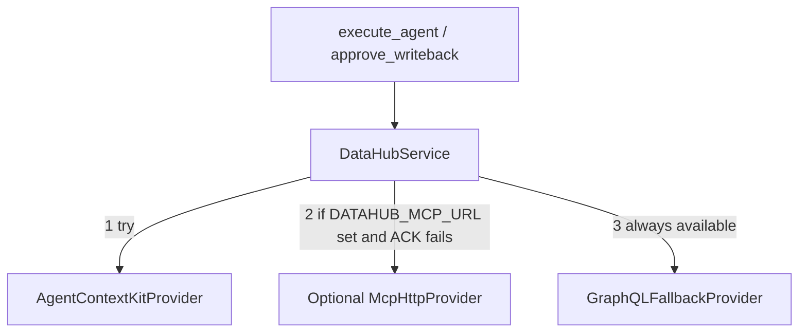

# Phase 1 Plan — DataHub MCP / Agent Context Kit Migration

## Goal

Evolve Synex from a custom GraphQL-first adapter into a **production DataHub Agent** that uses the official **Agent Context Kit** (`datahub-agent-context`) MCP tools first, with GraphQL retained only as fallback. Do **not** rewrite the FastAPI/Next.js product or replace the deterministic agent pipeline with a free-form LangChain agent.

## Locked architectural decisions

1. **Call official tools in-process** via:
   - `DataHubClient` (`datahub.sdk.main_client`)
   - `DataHubContext` (`datahub_agent_context.context`)
   - `datahub_agent_context.mcp_tools` (`search`, `get_entities`, `get_lineage`, …)
   
   These are the same tools exposed by DataHub’s MCP Server. This is the documented custom-agent path and avoids wrapping LangChain.

2. **Keep Synex’s fixed pipeline** (search → score → enrich → generate → validate → propose → approve → mutate). Tools are invoked programmatically; the LLM still only synthesizes SQL/YAML.

3. **Provider stack (fail-down, never reduce capability)**:

4. **Mutations stay human-gated**: multi-aspect **proposals** → UI preview → `/writeback/approve` → official mutation tools → audit. No auto-mutate.

5. **GraphQL adapter stays** in [`backend/app/services/datahub_context.py`](backend/app/services/datahub_context.py) as fallback only (not deleted).

6. **Packages**: `datahub-agent-context` (latest stable, currently `1.6.0.16`), keep `acryl-datahub`, optional `mcp` for HTTP transport. No LangChain dependency required for the core path.

---

## Migration map (current → target)

| Current | Replacement | Reason | Risk |
|---|---|---|---|
| `search_candidates` GraphQL | `mcp_tools.search` | Official search tool | Query syntax (`/q`) differs; normalize prompt → `/q …` + `filter=entity_type=dataset` |
| `get_entity_metadata` GraphQL | `mcp_tools.get_entities` | Richer entity payload | Response shape differs; normalize to Synex models |
| `list_schema_fields` (unused) | `mcp_tools.list_schema_fields` | Official schema tool | Low |
| `get_upstream/downstream_lineage` | `mcp_tools.get_lineage` (+ hops) | Multi-hop / column lineage | Soft-fail today; keep soft-fail + normalize |
| Unused `get_sql_query_context` | `get_dataset_queries` + `search_documents` / `grep_documents` + assertions | Expand context | Empty catalogs → empty lists |
| `emit_governed_proposal` description-only | `update_description` + `add_tags` / terms / domains / owners / `save_document` | Metadata authoring agent | Partial Cloud/OSS support; per-op try + audit |
| `httpx` OpenAPI aspect fetch | Prefer ACK mutations; REST only if needed for rollback preview | Less custom code | Low |
| Unused `datahub_client.py` facade | Replace with `DataHubService` | Single service boundary | Call-site update |

---

## Implementation workstreams

### A. Backend service layer (new)

Create under `backend/app/services/datahub/`:

- `models.py` — normalized DTOs: `DatasetCandidate`, `EntityBundle`, `LineageGraph`, `QuerySnippet`, `DocumentHit`, `QualitySignals`, `MutationOp`, `EnrichedContext`, `ProviderSource`
- `service.py` — `DataHubService` with ordered providers + `source` telemetry (`ack` | `mcp_http` | `graphql`)
- `providers/ack_provider.py` — wraps official `mcp_tools` inside `DataHubContext`
- `providers/mcp_http_provider.py` — optional MCP client against `DATAHUB_MCP_URL` (Cloud or `http://gms:8080/mcp`)
- `providers/graphql_provider.py` — thin adapter over existing `DataHubContextAdapter`
- `context_builder.py` — builds rich LLM context package
- `mutations.py` — proposal build + approved execution map

Keep public singletons compatible where possible so [`agent_router.py`](backend/app/routers/agent_router.py) changes stay focused.

### B. Wire `execute_agent`

In [`backend/app/routers/agent_router.py`](backend/app/routers/agent_router.py):

1. Configure `DataHubService` from settings (`DATAHUB_GMS_URL`, token, optional `DATAHUB_MCP_URL`).
2. Search via service → normalize candidates.
3. Enrich selected + top candidates with `get_entities`, `list_schema_fields`, up/down `get_lineage`, `get_dataset_queries`, documents, assertions (best-effort).
4. Pass `EnrichedContext` into generator + reasoner.
5. **Session memory**: call `get_last_run_for_session`; pass `previous_sql`, prior URN, prior validation summary into generator.
6. Build **multi-op** `proposed_writeback.operations[]` (description, tags, glossary, domain, owners, document) — still `requires_approval: true`.
7. Persist enriched metadata fields needed by UI (`schema_fields`, lineage model, queries, `metadata_source`).

### C. Generator / validation

Update [`backend/app/agent/generator.py`](backend/app/agent/generator.py) prompt assembly to include the full MCP context package (owners, glossary, tags, quality, lineage, sample SQL, docs, institutional memory, platform, domains, PII, validation hints, prior session SQL).

Validation pipeline unchanged in strength; may consume richer PII/schema signals.

### D. Approval / mutations

Extend `approve_writeback` to execute each approved `MutationOp` via ACK tools (`update_description`, `add_tags`, …). Gate on `DATAHUB_MCP_MUTATIONS_ENABLED` **or** explicit approval (approval remains required either way). Record per-op success/failure in run audit. Description path falls back to existing `MetadataChangeProposalWrapper` if ACK `update_description` fails.

### E. Frontend

- Expand [`MetadataInspector.tsx`](frontend/src/components/MetadataInspector.tsx): owners, glossary, sample SQL, quality, docs, lineage depth, platform, `metadata_source` badge.
- Expand [`CodeSandbox.tsx`](frontend/src/components/CodeSandbox.tsx) / approval UX: preview multi-aspect proposal checklist before approve.
- Optionally feed lineage nodes from API into [`LineageGraph.tsx`](frontend/src/components/LineageGraph.tsx) when payload present (replace empty placeholder when real data exists).

### F. Config / docs / tests

- Update [`backend/app/core/config.py`](backend/app/core/config.py), `.env.example`, README, `API_CONTRACT.md`.
- Dependencies: add `datahub-agent-context` to `requirements.txt`.
- Tests: mock ACK provider + GraphQL fallback + mutation proposal/approve + offline/invalid-token + missing dataset; extend existing `test_backend.py`.
- Deliverables at end: files changed, architecture diagram, migration summary, remaining GraphQL deps, coverage %, tech debt.

---

## Out of scope (explicit)

- Replacing Synex with a LangChain conversational agent
- Removing GraphQL entirely
- Auto-mutating without approval
- Weakening SQLGlot/DuckDB/PII validation
- Full DB schema redesign (prefer jsonb fields on `synex_runs` via additive migration only)

---

## Success criteria

Judges should see Synex calling **official Agent Context Kit MCP tools** (`datahub_agent_context.mcp_tools`) for search/entity/lineage/queries/docs/mutations, with GraphQL only on fallback, multi-aspect approved write-back, richer prompts, and wired session memory — without losing current run/history/settings UX.
