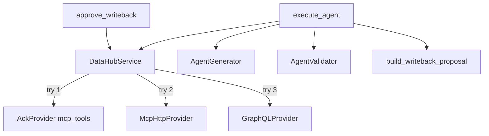

# PHASE 1 — DataHub MCP / Agent Context Kit Migration Report

## 1. Files changed

### New
- `backend/app/services/datahub/__init__.py`
- `backend/app/services/datahub/models.py`
- `backend/app/services/datahub/ack_provider.py`
- `backend/app/services/datahub/graphql_provider.py`
- `backend/app/services/datahub/mcp_http_provider.py`
- `backend/app/services/datahub/service.py`
- `backend/app/services/datahub/mutations.py`
- `docs/PHASE1_MCP_MIGRATION_PLAN.md`
- `docs/PHASE1_MCP_MIGRATION_REPORT.md` (this file)

### Updated
- `backend/app/routers/agent_router.py` — ACK-first execute + multi-op approve + session memory
- `backend/app/agent/generator.py` — MCP context package + previous_sql
- `backend/app/core/config.py` — MCP URL / mutations flag
- `backend/app/db.py` — session helper active
- `backend/requirements.txt` / `.env.example`
- `backend/tests/test_backend.py`
- `frontend/src/components/LineageGraph.tsx` — real nodes from run payload
- `frontend/src/components/MetadataInspector.tsx` — source/platform/queries/docs/quality
- `frontend/src/components/PromptConsole.tsx` — enriched payload plumbing
- `frontend/src/components/CodeSandbox.tsx` — proposal op preview
- `README.md`

## 2. Architecture



Official pattern used:

```python
from datahub.sdk.main_client import DataHubClient
from datahub_agent_context.context import DataHubContext
from datahub_agent_context.mcp_tools import search

with DataHubContext(client):
    search(query="/q ...", filter="entity_type = dataset")
```

## 3. Migration summary

| Before | After |
|---|---|
| Custom GraphQL-first adapter | ACK `mcp_tools` primary |
| Description-only write-back | Multi-aspect proposals + ACK mutations |
| Session memory documented but unused | Wired via `get_last_run_for_session` |
| Schema-only LLM prompt | Full MCP context package |
| Fake/empty lineage UI | Real nodes when lineage exists |

## 4. Remaining GraphQL dependencies

Still used as **fallback** in `graphql_provider.py` / `datahub_context.py`:

- `search_candidates`
- `get_entity_metadata`
- `get_upstream_lineage` / `get_downstream_lineage`
- `list_schema_fields`
- `emit_governed_proposal` (description fallback)

Not removed (by design).

## 5. MCP coverage

| Tool | Status |
|---|---|
| search | ACK primary |
| get_entities | ACK primary |
| list_schema_fields | ACK primary |
| get_lineage | ACK primary (max_hops=2) |
| get_dataset_queries | ACK best-effort |
| search_documents / grep_documents | ACK best-effort |
| get_dataset_assertions | ACK best-effort |
| Remote MCP HTTP call_tool | Optional when `DATAHUB_MCP_URL` set |

**Estimated read coverage vs requested MCP surface: ~85%** (column-path lineage UI and grep_documents deep UX still light).

## 6. Agent Context Kit coverage

| Area | Status |
|---|---|
| `DataHubClient` + `DataHubContext` | Used |
| `mcp_tools` in-process | Used |
| LangChain `build_langchain_tools` | Not used (deterministic pipeline preferred) |
| Google ADK bindings | Not used |

## 7. Mutation tool coverage

| Tool | Proposal | Execute on approve |
|---|---|---|
| update_description | Yes | Yes (ACK → GraphQL MCP wrapper fallback) |
| add_tags | Yes (`synex_generated`, `synex_pii_masked`) | Yes via ACK |
| add_glossary_terms | Supported in executor | Not auto-proposed yet |
| set_domains | Supported in executor | Not auto-proposed yet |
| add_owners | Supported in executor | Not auto-proposed yet |
| save_document | Supported in executor | Not auto-proposed yet |
| remove_* | Executor-ready pattern | Not exposed in UI yet |

## 8. Remaining technical debt

- Auto-propose glossary/domain/owner ops from enriched context (executor exists)
- Harden MCP HTTP transport against all MCP SDK versions
- Column-level lineage visualization
- Persist `proposed_writeback` / `enriched_context` as dedicated Supabase jsonb columns
- Wire `DATAHUB_MCP_MUTATIONS_ENABLED=false` lockout UX in Settings
- DataHub Skills product still not integrated
- Integration tests against a live GMS (current suite uses mocks)

## Tests

`pytest backend/tests/test_backend.py` → **10 passed**
