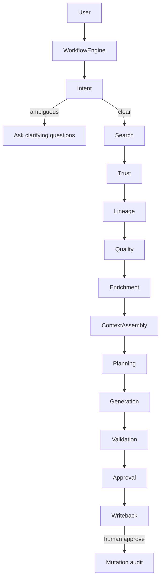
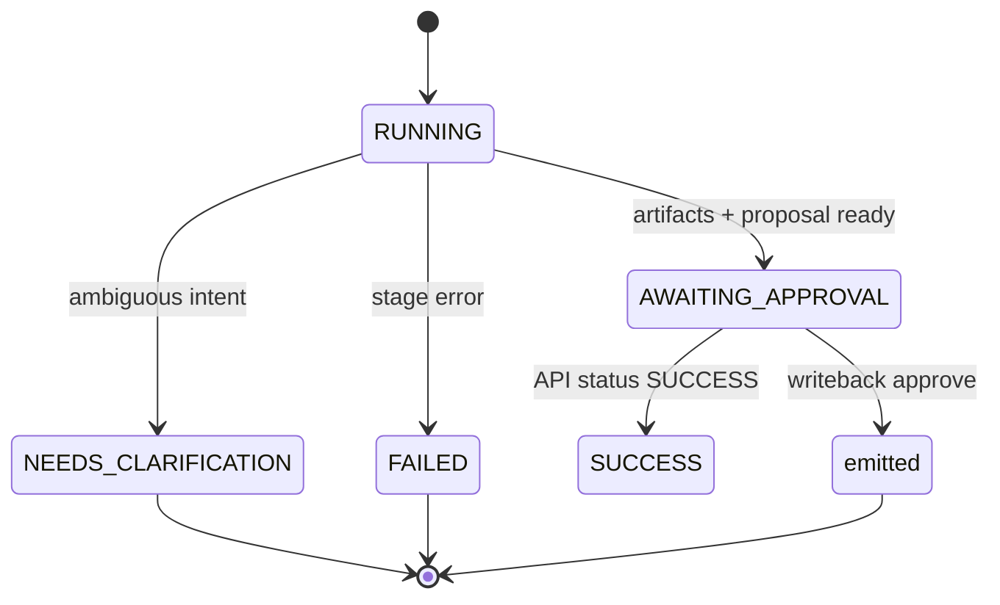

# PHASE 2 — Autonomous Data Engineering Workflow Engine

## 1. Files created

- `backend/app/workflow/__init__.py`
- `backend/app/workflow/models.py`
- `backend/app/workflow/base.py`
- `backend/app/workflow/engine.py`
- `backend/app/workflow/stages/__init__.py`
- `backend/app/workflow/stages/intent.py`
- `backend/app/workflow/stages/search.py`
- `backend/app/workflow/stages/trust.py`
- `backend/app/workflow/stages/lineage.py`
- `backend/app/workflow/stages/quality.py`
- `backend/app/workflow/stages/enrichment.py`
- `backend/app/workflow/stages/context_assembly.py`
- `backend/app/workflow/stages/planning.py`
- `backend/app/workflow/stages/generation.py`
- `backend/app/workflow/stages/validation.py`
- `backend/app/workflow/stages/approval.py`
- `backend/app/workflow/stages/writeback.py`
- `frontend/src/components/WorkflowTimeline.tsx`
- `docs/migrations/phase2_workflow_steps.sql`
- `docs/PHASE2_WORKFLOW_REPORT.md` (this file)

## 2. Files modified

- `backend/app/routers/agent_router.py` — `execute_agent` → `WorkflowEngine`; SSE emits stage events
- `backend/app/db.py` — resilient update without optional `workflow_steps` column
- `backend/tests/test_backend.py` — workflow mocks + intent ambiguity test
- `frontend/src/components/PromptConsole.tsx` — SSE `/api/v1/agent/run` with JSON fallback
- `frontend/src/components/ChatThread.tsx` — workflow timeline + plan UI
- `frontend/src/store/useWorkspaceStore.ts` — workflow/plan fields
- `frontend/src/app/history/page.tsx` — workflow steps in run detail
- `README.md` — architecture + capabilities

## 3. Workflow architecture

## 4. Workflow state machine

Stage statuses: `pending` → `running` → `completed` | `failed` | `waiting` | `skipped`.

## 5. UI changes

- Live **Engineering Workflow** timeline (not a spinner)
- **Engineering Plan** panel after completion
- Clarifying questions rendered when intent is ambiguous
- History page shows persisted workflow steps
- Prompt console streams SSE stage events

## 6. Backend changes

- Modular stages under `app/workflow/stages/`
- Multi-dimensional trust scores + rank explanations
- Single `EngineeringContext` package for the LLM
- Expanded validation report (naming, lineage, quality)
- Approval + write-back stages prepare proposals only; mutations remain approve-gated

## 7. Database changes

Optional migration: [`docs/migrations/phase2_workflow_steps.sql`](migrations/phase2_workflow_steps.sql)

- Adds `synex_runs.workflow_steps jsonb`
- Full step payloads also stored in `trace_logs` for backward compatibility

## 8. Streaming implementation

- Endpoint: `POST /api/v1/agent/run` (SSE)
- Each stage emits `WORKFLOW_<STAGE>` events with status, duration, reasoning, trust
- Final `COMPLETED` event includes full payload
- UI falls back to `POST /api/v1/run` if stream body unavailable

## 9. Remaining improvements

- LLM-assisted intent (still rule-based; no external Skills)
- True column-level lineage edges from ACK when available
- Persist `engineering_context` / `proposed_writeback` as dedicated columns
- Settings toggle to force clarification threshold
- Parallel candidate enrichment for latency

## 10. Technical debt

- `NEEDS_CLARIFICATION` stored as DB `FAILED` when CHECK lacks that value (API still returns `NEEDS_CLARIFICATION`)
- Approval/writeback stages mark `waiting` after `complete()` (status override)
- Trust/lineage stages re-fetch entity/lineage (enrichment also fetches) — optimize later
- Frontend `ProposedWriteback.operations` typing still loose (`string[] | object[]`)

## 11. DataHub judging criteria impact

| Criterion | How Phase 2 helps |
|---|---|
| Real DataHub integration | Workflow stages call ACK/MCP tools for search, entity, lineage, enrichment |
| Agent quality | Visible multi-stage engineering workflow, not prompt→SQL |
| Governance | Trust + quality gates; mutations never auto-execute |
| Explainability | Rank why, plan, timeline, reasoning summaries |
| Demo clarity | Judges see Skills-inspired stages stream live |

## Tests

`pytest backend/tests/test_backend.py` → **11 passed**
