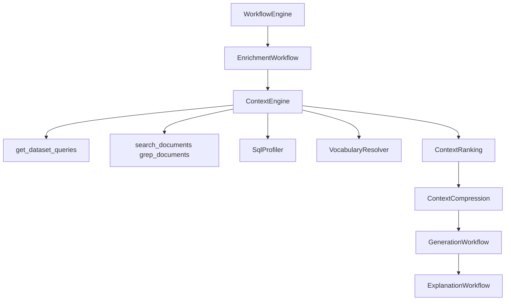

# PHASE 3 — Engineering Context Engine Report

## 1. Files modified

- `backend/app/services/datahub/ack_provider.py` — `grep_documents`
- `backend/app/services/datahub/service.py` — `grep_documents` fail-down
- `backend/app/workflow/models.py` — context fields on `EngineeringContext` / `WorkflowState`
- `backend/app/workflow/engine.py` — Explanation stage + context payload in results
- `backend/app/workflow/stages/context_assembly.py` — delegates to Context Engine
- `backend/app/workflow/stages/generation.py` — Context Engine package only
- `backend/app/agent/generator.py` — production-pattern / vocabulary rules
- `backend/app/routers/agent_router.py` — engineering memory + context persistence
- `backend/app/db.py` — optional Phase-3 columns stripped on schema miss
- `backend/tests/test_backend.py` — Phase-3 coverage
- `frontend/src/components/MetadataInspector.tsx` — evidence panels
- `frontend/src/components/PromptConsole.tsx` — context payload plumbing
- `frontend/src/components/ChatThread.tsx` — Context Evidence checklist
- `README.md` — (capabilities reflected in architecture from Phase 2; engine deepened)

## 2. New services created

| Module | Role |
|---|---|
| `backend/app/context/engine.py` | Context Engine orchestrator |
| `backend/app/context/models.py` | ContextPackage, SqlProfile, Manifest, Vocabulary |
| `backend/app/context/sql_profiler.py` | Production SQL pattern extraction |
| `backend/app/context/pattern_library.py` | Reusable SQL Pattern Library |
| `backend/app/context/vocabulary.py` | Business terminology resolver |
| `backend/app/context/ranking.py` | Context item scoring |
| `backend/app/context/compress.py` | Token-budget compression |
| `backend/app/context/explanation.py` | Post-gen SQL explanation |
| `backend/app/workflow/stages/explanation.py` | Workflow stage wrapper |

## 3. Context Engine architecture

The LLM never searches DataHub. Only the Context Engine does (via ACK / MCP / GraphQL providers).

## 4. Agent Context Kit integration map

| ACK tool | Used by |
|---|---|
| `search` | SearchWorkflow |
| `get_entities` / `list_schema_fields` | Trust + Enrichment |
| `get_lineage` | LineageWorkflow |
| `get_dataset_queries` | Context Engine (mandatory) |
| `search_documents` | Context Engine |
| `grep_documents` | Context Engine |
| `get_dataset_assertions` | Enrichment / quality |
| Mutations | Approval-gated write-back |

## 5. Production Query Intelligence

- Mandatory refresh via `get_dataset_queries`
- `SqlProfiler` extracts joins, WHERE, GROUP BY, aggregations, windows, CTEs, date/null handling, aliases, derived metrics
- Profile injected into compressed LLM package

## 6. Documentation Intelligence

- `search_documents(prompt)` + `grep_documents(prompt)`
- Ranked by business relevance; low-score docs dropped in compression

## 7. Institutional Memory

- Entity institutional memory elements
- Deprecation / upstream risk notes
- Prior session engineering memory (SQL, dataset, patterns, vocabulary, warnings)

## 8. SQL Pattern Library design

`PatternLibrary` stores:

- join_patterns, revenue_calculations, currency_conversion
- time_filters, window_functions, deduplication, scd_patterns
- preferred_aliases, business_metrics

Ingested from SqlProfile + prior engineering memory; consulted before generation.

## 9. Frontend enhancements

- Inspector: Context Evidence checklist, ownership, glossary, vocabulary, production patterns, institutional memory, SQL explanation
- Chat: Context Evidence panel + explanation summary
- Result payload includes `context_package`, `context_manifest`, `sql_explanation`, `engineering_memory`

## 10. Database changes

Optional: [`docs/migrations/phase3_context_engine.sql`](migrations/phase3_context_engine.sql)

- `context_summary jsonb`
- `sql_explanation jsonb`
- (plus Phase-2 `workflow_steps`)

Graceful fallback if columns absent.

## 11. Test coverage

`pytest backend/tests/test_backend.py` → **17 passed**

Includes:

- SQL profiler patterns
- Vocabulary resolution
- Ranking prefers production SQL
- Compression contents
- Explanation cites evidence
- Context Engine build with empty docs fallback
- End-to-end run asserts queries/docs/grep called and generator receives profile+vocab block

## 12. Remaining technical debt

- Role-typed ownership (steward vs platform) is inferred when DataHub only returns flat owners
- Column-level lineage still schema-path proxy
- Engineering memory persistence across process restarts needs dedicated Supabase jsonb column
- Vocabulary seed graph is heuristic — should sync from live glossary nodes
- Live GMS demo 401 still blocks end-to-end without PAT

## 13. Judging criteria impact

| Criterion | Improvement |
|---|---|
| Deep ACK usage | Mandatory queries + docs + grep in reasoning path |
| Non-chatbot agent | Context checklist makes organizational grounding visible |
| Trustworthy SQL | Production patterns + vocabulary + explanation |
| Governance | Context ranked; low-quality items dropped |
| Demo clarity | Inspector shows exact evidence used for generation |
