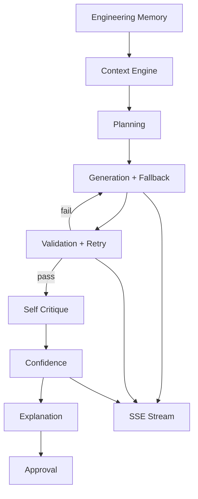

# PHASE 4 — Production Resilience Report

## 1. Files modified

- `backend/app/core/config.py` — fallback order, retries, timeouts, provider keys
- `backend/app/agent/generator.py` — provider router + model selection + retry feedback
- `backend/app/routers/agent_router.py` — structured engineering memory + observability seed
- `backend/app/db.py` — optional observability/confidence columns
- `backend/app/workflow/models.py` — critique / confidence / observability state
- `backend/app/workflow/engine.py` — new stages + result fields
- `backend/app/workflow/stages/generation.py` — streaming hooks + memory + LLM attempts
- `backend/app/workflow/stages/validation.py` — automatic retry engine
- `backend/app/workflow/stages/explanation.py` — richer explanation fields
- `backend/app/context/explanation.py` — validation/governance/risks/alternatives
- `backend/tests/test_backend.py` — Phase-4 coverage
- `backend/.env.example` — new LLM resilience vars
- Frontend: PromptConsole / ChatThread / MetadataInspector — confidence + observability

## 2. Architecture updates

Stages now: intent → search → trust → lineage → quality → enrichment → context_assembly → planning → generation → validation → **self_critique** → **confidence** → explanation → approval → writeback

## 3. Provider abstraction

`app/llm/providers.py` — `LLMProviderRouter`

- OpenAI-compatible: OpenRouter, OpenAI, Groq, Gemini bridge, etc.
- Anthropic native
- Configurable `LLM_FALLBACK_ORDER`
- Classifies failures: timeout / rate_limit / unavailable / generation
- Returns latency + token usage + attempt log

## 4. Retry engine

`ValidationWorkflow` retries up to `LLM_MAX_RETRIES` (default 2):

- Feeds blocking errors into generator as `retry_feedback`
- Escalates to complex model task hint
- Emits SSE `RETRY` events
- Records failures in observability

## 5. Streaming implementation

SSE `/api/v1/agent/run` now emits:

- Workflow stage events (existing)
- `REASONING` / `LLM_ATTEMPT`
- `SQL_TOKEN` partial chunks
- `RETRY`
- `CONFIDENCE`
- `COMPLETED` payload

UI updates live without waiting for full generation.

## 6. Memory implementation

`app/memory/engineering_memory.py`

- Restores `get_last_run_for_session` into structured memory
- Persists preferred joins/datasets, metrics, validation failures, successful/rejected SQL, trust history, glossary, lineage, write-back proposals
- Injected into every generation prompt (not raw chat)

## 7. Confidence engine

`app/llm/confidence.py` — weighted score from:

schema, validation, trust, production SQL, glossary, ownership, quality, lineage, docs, conversation memory, self-critique, retry penalty

Returns `score`, `level`, `why_high`, `why_low`, `summary`.

## 8. Reasoning pipeline

Intent → Planning → Generation → Validation → Self Critique → Confidence → Explanation → Approval

Self-critique (`app/llm/critique.py`) answers engineer-approval questions; optional LLM critique via fast model.

## 9. Test coverage

`pytest backend/tests/test_backend.py` → **22 passed**

New tests: engineering memory, model selection, confidence, deterministic critique, fallback chain ordering, e2e asserts confidence/critique/observability.

## 10. Remaining technical debt

- True token streaming from provider SDKs (currently chunked post-generation for UX)
- Gemini native SDK path (currently OpenAI-compatible bridge)
- Persist engineering memory as dedicated Supabase jsonb across restarts
- Critique LLM JSON can be flaky — deterministic path always runs
- Provider keys beyond primary OpenRouter often empty in local `.env`

## Judging impact

Synex no longer looks like a single-shot LLM wrapper: it remembers engineering work, retries with validator feedback, fails over providers, streams reasoning, and publishes confidence + observability for every run.
